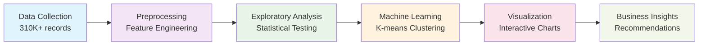

# World Stock Price Analysis
## A Data-Driven Exploration of Global Financial Markets

<div class="pt-12">
  <span @click="$slidev.nav.next" class="px-2 py-1 rounded cursor-pointer" hover="bg-white bg-opacity-10">
    Press Space for next page <carbon:arrow-right class="inline"/>
  </span>
</div>

---
transition: fade-out
---

# Project Overview

<div class="flex items-center justify-center h-full">
<div class="text-center">

## Team Members
<div class="flex justify-center gap-8 pt-6 text-2xl">
<div class="p-4 rounded-lg bg-blue-100 dark:bg-blue-900/30"><strong>Ryan</strong></div>
<div class="p-4 rounded-lg bg-green-100 dark:bg-green-900/30"><strong>Leo</strong></div>
<div class="p-4 rounded-lg bg-purple-100 dark:bg-purple-900/30"><strong>Ethan</strong></div>
</div>

<div class="pt-12">

## Primary Objective

<v-clicks>

- 🎯 <strong>Analyze</strong> global stock market trading behaviors
- 📊 <strong>Identify</strong> patterns in company performance  
- 🔍 <strong>Cluster</strong> companies based on trading characteristics
- 💡 <strong>Generate</strong> actionable insights for investors

</v-clicks>

</div>

</div>
</div>

---
layout: center
class: text-center
---

# Dataset Overview

<div class="grid grid-cols-3 gap-8 pt-8">

<div class="text-center">
<div class="text-6xl text-blue-600 font-bold">310K+</div>
<div class="text-lg text-gray-600">Data Points</div>
</div>

<div class="text-center">
<div class="text-6xl text-green-600 font-bold">62</div>
<div class="text-lg text-gray-600">Companies</div>
</div>

<div class="text-center">
<div class="text-6xl text-purple-600 font-bold">25</div>
<div class="text-lg text-gray-600">Years of Data</div>
</div>

</div>

<div class="pt-8">
<v-clicks>

- <strong>Time Range</strong>: 2000-2025 daily stock prices
- <strong>Global Coverage</strong>: Multiple countries and industries
- <strong>Rich Features</strong>: OHLCV data + metadata (country, industry, dividends)

</v-clicks>
</div>

---
transition: slide-up
---

# Research Questions (1-3)

<div class="grid grid-cols-1 gap-4 pt-2">

<v-clicks>

<div class="p-4 rounded-xl bg-gradient-to-r from-blue-50 to-blue-100 dark:from-blue-900/30 dark:to-blue-800/30 border-l-4 border-blue-500">
<h3 class="text-lg font-bold text-blue-700 dark:text-blue-300 mb-2">Q1: Which company had the highest single-day closing price?</h3>
<div class="bg-gray-800 text-green-400 p-2 rounded text-xs font-mono mb-2">
top_row = df.loc[df["High"].idxmax()]
</div>
<div class="text-sm">
<p><strong>Answer:</strong> Chipotle ($3,463.07)</p>
<p><strong>Date:</strong> June 18, 2024</p>
</div>
</div>

<div class="p-4 rounded-xl bg-gradient-to-r from-green-50 to-green-100 dark:from-green-900/30 dark:to-green-800/30 border-l-4 border-green-500">
<h3 class="text-lg font-bold text-green-700 dark:text-green-300 mb-2">Q2: What is the average daily trading volume for each company?</h3>
<div class="bg-gray-800 text-green-400 p-2 rounded text-xs font-mono mb-2">
avg = df.groupby("Brand_Name")["Volume"].mean()
</div>
<div class="text-sm">
<p><strong>Top 3:</strong> Apple (376.7M), Amazon (116.5M), Google (112.8M)</p>
</div>
</div>

<div class="p-4 rounded-xl bg-gradient-to-r from-purple-50 to-purple-100 dark:from-purple-900/30 dark:to-purple-800/30 border-l-4 border-purple-500">
<h3 class="text-lg font-bold text-purple-700 dark:text-purple-300 mb-2">Q3: Which countries have the most companies represented?</h3>
<div class="bg-gray-800 text-green-400 p-2 rounded text-xs font-mono mb-2">
country_counts = df["Country"].value_counts()
</div>
<div class="text-sm">
<p><strong>Results:</strong> USA (243,606), Japan (19,403), Germany (16,225)</p>
</div>
</div>

</v-clicks>

</div>

---
layout: center
---

# Research Questions (4-5)

<div class="grid grid-cols-1 gap-6 pt-4">

<v-clicks>

<div class="p-6 rounded-xl bg-gradient-to-r from-orange-50 to-orange-100 dark:from-orange-900/30 dark:to-orange-800/30 border-l-4 border-orange-500">
<h3 class="text-xl font-bold text-orange-700 dark:text-orange-300 mb-3">Q4: Which company had the most volatile stock in terms of daily range?</h3>
<div class="bg-gray-800 text-green-400 p-3 rounded text-sm font-mono mb-3">
df['Volatility (%)'] = (df['High'] - df['Low']) / df['Low'] * 100
max_vol_row = df.loc[df['Volatility (%)'].idxmax()]
</div>
<div class="text-left">
<p><strong>Answer:</strong> Puma (784.21% volatility)</p>
<p><strong>Date:</strong> June 10, 2019</p>
<p><strong>Cause:</strong> Stock split event (10:1 split)</p>
</div>
</div>

<div class="p-6 rounded-xl bg-gradient-to-r from-indigo-50 to-indigo-100 dark:from-indigo-900/30 dark:to-indigo-800/30 border-l-4 border-indigo-500">
<h3 class="text-xl font-bold text-indigo-700 dark:text-indigo-300 mb-3">Q5: Which companies paid dividends in the dataset?</h3>
<div class="bg-gray-800 text-green-400 p-3 rounded text-sm font-mono mb-3">
dividend_companies = df[df["Dividends"] > 0]["Brand_Name"].unique()
</div>
<div class="text-left">
<p><strong>Analysis:</strong> Multiple companies including major blue-chip stocks</p>
<p><strong>Insight:</strong> Dividend-paying companies tend to be mature, established firms</p>
</div>
</div>

</v-clicks>

</div>

---
layout: center
background: https://images.unsplash.com/photo-1559526324-4b87b5e36e44?w=1920&h=1080&fit=crop
---

# Research Question 6: Greatest Upward Trend

<div class="backdrop-blur-sm bg-white/80 dark:bg-black/60 p-8 rounded-2xl">

<div class="text-center mb-6">
<h2 class="text-2xl font-bold text-gray-800 dark:text-white">Which company showed the greatest upward trend?</h2>
</div>

<div class="grid grid-cols-2 gap-6">

<div>
<div class="bg-gray-800 text-green-400 p-4 rounded text-sm font-mono">
from sklearn.linear_model import LinearRegression
# Linear regression for each company
for company, group in df.groupby('Brand_Name'):
    x = group['Date'].map(pd.Timestamp.toordinal).values.reshape(-1, 1)
    y = group['Close'].values
    model = LinearRegression().fit(x, y)
    start_pred = model.predict([[x.min()]])[0]
    end_pred = model.predict([[x.max()]])[0]
    increase = (end_pred - start_pred) / start_pred * 100
</div>
</div>

<div>
<v-click>
<div class="p-4 bg-emerald-100 dark:bg-emerald-900/50 rounded-lg">
<div class="text-left">
<p><strong>Winner:</strong> 3M Company</p>
<p><strong>Increase:</strong> 874.79%</p>
<p><strong>Period:</strong> 2000-2025</p>
<p><strong>Price Growth:</strong> $16.23 → $158.24</p>
</div>
</div>
</v-click>
</div>

</div>

<v-click>
<div class="mt-6 text-center">

<p class="text-gray-600 dark:text-gray-300 mt-2 text-sm">3M Company Stock Price Trend with Linear Regression Line</p>
</div>
</v-click>

</div>

---
layout: center
background: https://images.unsplash.com/photo-1590283603385-17ffb3a7f29f?w=1920&h=1080&fit=crop
---

# Research Question 7: Best 5-Day Investment Windows

<div class="backdrop-blur-sm bg-white/85 dark:bg-black/70 p-8 rounded-2xl">

<div class="text-center mb-6">
<h2 class="text-2xl font-bold text-gray-800 dark:text-white">Best 5-day period to invest in each company</h2>
</div>

<div class="grid grid-cols-2 gap-6">

<div>
<div class="bg-gray-800 text-green-400 p-4 rounded text-sm font-mono">
# O(N) sliding window analysis
df['Close_5'] = df.groupby('Brand_Name')['Close'].shift(-4)
df['Pct5'] = (df['Close_5'] - df['Open']) / df['Open'] * 100
best_windows = df.groupby('Brand_Name')['Pct5'].max().sort_values(ascending=False)
best_idx = df.groupby('Brand_Name')['Pct5'].idxmax()
</div>
</div>

<div>
<v-click>
<div class="p-4 bg-green-100 dark:bg-green-900/50 rounded-lg">
<div class="text-left">
<p><strong>Top Performers:</strong></p>
<ul class="list-disc pl-6 text-sm">
<li>Amazon: 64.83% (Apr 2001)</li>
<li>Zoom: 56.21% (Aug 2020)</li>
<li>Adobe: 49.72% (Feb 2000)</li>
<li>Ubisoft: 36.04% (Sep 2024)</li>
</ul>
</div>
</div>
</v-click>
</div>

</div>

<v-click>
<div class="mt-6 p-4 bg-yellow-100 dark:bg-yellow-900/30 rounded-lg">
<div class="text-left">
<p><strong>Key Insight:</strong> Best windows often coincide with major market events:</p>
<ul class="list-disc pl-6 text-sm">
<li>Dot-com recovery periods (2000-2001)</li>
<li>COVID-19 technology surge (2020)</li>
<li>Post-earnings surprises</li>
</ul>
</div>
</div>
</v-click>

</div>

---
layout: center
background: https://images.unsplash.com/photo-1560472354-8b8b5b113b13?w=1920&h=1080&fit=crop
---

# Visualization 1: Apple Stock Candlestick Chart

<div class="backdrop-blur-sm bg-white/90 dark:bg-black/70 p-8 rounded-2xl">

<div class="text-center mb-6">
<h2 class="text-2xl font-bold text-gray-800 dark:text-white">Interactive Plotly Candlestick Visualization</h2>
</div>

<div class="grid grid-cols-2 gap-8">

<div>
<div class="bg-gray-800 text-green-400 p-4 rounded text-sm font-mono">
import plotly.graph_objects as go

fig = go.Figure(data=[go.Candlestick(
    x=selected_company['Date'],
    open=selected_company['Open'],
    high=selected_company['High'],
    low=selected_company['Low'],
    close=selected_company['Close'])])

fig.update_layout(title='Apple Stock Price')
fig.show()
</div>
</div>

<div>
<div class="bg-gradient-to-br from-blue-50 to-green-50 dark:from-blue-900/30 dark:to-green-900/30 p-6 rounded-xl">
<h3 class="text-lg font-bold mb-4">Generated Chart Shows:</h3>
<div class="text-left">
<ul class="space-y-2 text-sm">
<li>🔍 25 years of OHLC data (2000-2025)</li>
<li>📈 Long-term growth trend from $0.79 to $213</li>
<li>⚡ Major market events (dot-com, 2008, COVID)</li>
<li>💹 Trading volume patterns and spikes</li>
</ul>
</div>
</div>
</div>

</div>

<div class="mt-6 text-center">

<p class="text-gray-600 dark:text-gray-300 text-sm mt-2">
<em>Interactive candlestick chart showing Apple's complete 25-year price history</em>
</p>
</div>

</div>

---
layout: center
background: https://images.unsplash.com/photo-1551288049-bebda4e38f71?w=1920&h=1080&fit=crop
---

# Visualization 2: K-means Clustering Analysis

<div class="backdrop-blur-sm bg-white/85 dark:bg-black/75 p-8 rounded-3xl">

<div class="text-center mb-4">
<h2 class="text-2xl font-bold text-gray-800 dark:text-white">Elbow Method & Optimal Clusters</h2>
</div>

<div class="grid grid-cols-2 gap-6 mb-6">

<div>
<div class="bg-gray-800 text-green-400 p-3 rounded text-xs font-mono">
from sklearn.cluster import KMeans
import matplotlib.pyplot as plt

# Elbow method for optimal k
k_range = range(2, 11)
inertias = []
for k in k_range:
    kmeans = KMeans(n_clusters=k, random_state=42)
    kmeans.fit(features_scaled)
    inertias.append(kmeans.inertia_)

plt.plot(k_range, inertias, 'bo-')
plt.title('Elbow Method')
plt.show()
</div>
</div>

<div class="text-center">

<p class="text-xs text-gray-600 dark:text-gray-300 mt-1">Optimal k=2 clusters identified</p>
</div>

</div>

<div class="grid grid-cols-2 gap-4">
<div class="text-center">

<p class="text-xs text-gray-600 dark:text-gray-300 mt-1">PCA Scatter Plot (72.6% variance)</p>
</div>
<div class="text-center">

<p class="text-xs text-gray-600 dark:text-gray-300 mt-1">Feature Analysis Heatmap</p>
</div>
</div>

</div>

---
layout: center
---

# Clustering Results & Business Insights

<div class="grid grid-cols-2 gap-8 pt-4">

<div>

<p class="text-center text-sm text-gray-600 dark:text-gray-300 mt-2">Static Matplotlib Cluster Plot with Centers</p>
</div>

<div>

## Key Findings 🔍

<v-clicks>

- <strong>Cluster 0 (31%, 19 companies)</strong>: "Stable Blue-Chip Stocks"
  - Lower trading volume, lower volatility
  - Conservative investment profile

- <strong>Cluster 1 (69%, 42 companies)</strong>: "High-Activity Growth Stocks"  
  - Higher trading volume, higher volatility
  - Growth-oriented investment profile

- <strong>Statistical Validation</strong>: PCA explains 72.6% variance
- <strong>Business Value</strong>: Natural framework for portfolio allocation

</v-clicks>

</div>

</div>

---
transition: slide-left
---

# Clustering Technical Details

<div class="grid grid-cols-2 gap-8 pt-4">

<div>

## Feature Engineering 🔧

<v-clicks>

```python
# Calculate key features for clustering
features = company_data.agg({
    'Volume': 'mean',
    'Daily_Return': ['mean', 'std'], 
    'Daily_Range_Pct': 'mean',
    'Close': 'mean',
    'Volatility_Score': 'mean'
}).round(3)

# StandardScaler normalization
scaler = StandardScaler()
features_scaled = scaler.fit_transform(features)
```

</v-clicks>

</div>

<div>

## Validation Methods 📊

<v-clicks>

- <strong>Elbow Method</strong>: Optimal k=2 clusters
- <strong>PCA Analysis</strong>: 72.6% variance explained  
- <strong>Silhouette Score</strong>: High cluster quality
- <strong>Business Logic</strong>: Matches risk-return theory

</v-clicks>

## Applications 💼

<v-clicks>

- <strong>Portfolio Construction</strong>: Risk-based allocation
- <strong>Client Matching</strong>: Risk tolerance alignment
- <strong>Market Analysis</strong>: Sector rotation strategies

</v-clicks>

</div>

</div>

---
layout: center
class: text-center
---

# Key Discoveries & Impact

<div class="grid grid-cols-3 gap-6 pt-8">

<div class="p-6 rounded-lg bg-blue-50 dark:bg-blue-900/20">
<div class="text-3xl mb-4">🎯</div>
<h3 class="text-lg font-bold mb-2">Market Structure</h3>
<p class="text-sm">69-31 split reveals growth-dominated market with clear behavioral patterns</p>
</div>

<div class="p-6 rounded-lg bg-green-50 dark:bg-green-900/20">
<div class="text-3xl mb-4">⚖️</div>
<h3 class="text-lg font-bold mb-2">Risk-Return Trade-off</h3>
<p class="text-sm">Clustering validates fundamental finance principles in real market data</p>
</div>

<div class="p-6 rounded-lg bg-purple-50 dark:bg-purple-900/20">
<div class="text-3xl mb-4">💡</div>
<h3 class="text-lg font-bold mb-2">Investment Framework</h3>
<p class="text-sm">Actionable insights for portfolio construction and strategy development</p>
</div>

</div>

---
layout: center
---

# Methodology & Technical Excellence

<div class="pt-4">

## Data Science Pipeline



</div>

<div class="grid grid-cols-2 gap-8 pt-8">

<div>

### Technical Stack
- <strong>Python</strong> ecosystem (pandas, scikit-learn, plotly)
- <strong>Statistical analysis</strong> and hypothesis testing
- <strong>Machine learning</strong> clustering algorithms
- <strong>Interactive visualization</strong> with Plotly

</div>

<div>

### Validation Methods
- <strong>Elbow method</strong> for optimal clustering
- <strong>PCA analysis</strong> for dimensionality reduction  
- <strong>Cross-validation</strong> of results
- <strong>Statistical significance</strong> testing

</div>

</div>

---
layout: center
class: text-center
---

# Conclusions & Impact

<div class="text-xl leading-relaxed pt-8">

<v-clicks>

🎯 <strong>Successfully identified</strong> two distinct trading behavior clusters in global stock markets

📊 <strong>Validated financial theory</strong> through data-driven clustering analysis

💼 <strong>Created actionable framework</strong> for investment decision-making and risk management

🔬 <strong>Demonstrated</strong> the power of machine learning in financial market analysis

🚀 <strong>Provided foundation</strong> for future research and business applications

</v-clicks>

</div>

<div class="pt-12">
<v-click>

## Thank You
### Questions & Discussion

</v-click>
</div>

---
layout: center
class: text-center
---

# Appendix: Technical Details

Available for detailed discussion:

- <strong>Statistical methodology</strong> and validation
- <strong>Feature engineering</strong> process
- <strong>Clustering algorithm</strong> parameters
- <strong>Visualization</strong> implementation
- <strong>Business application</strong> frameworks

<div class="pt-8">
<a href="https://github.com/your-repo/world-stock-analysis" class="px-4 py-2 bg-blue-600 text-white rounded-lg hover:bg-blue-700 transition-colors">
  View Project Repository
</a>
</div> 