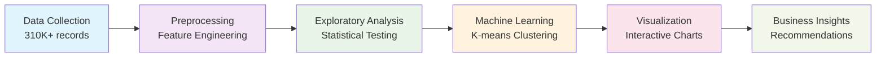

# World Stock Price Analysis
## A Data-Driven Exploration of Global Financial Markets

  
    Press Space for next page <carbon:arrow-right class="inline"/>
  

  <button @click="$slidev.nav.openInEditor()" title="Open in Editor" class="text-xl slidev-icon-btn opacity-50 !border-none !hover:text-white">
    <carbon:edit />
  </button>
  <a href="https://github.com/slidevjs/slidev" target="_blank" alt="GitHub" title="Open in GitHub"
    class="text-xl slidev-icon-btn opacity-50 !border-none !hover:text-white">
    <carbon-logo-github />
  </a>

---
transition: fade-out
---

# Team & Objective

## Team Members
- **Ryan**
- **Leo** 
- **Ethan**

## Project Duration
**2 weeks** - Comprehensive analysis from data acquisition to presentation

## Primary Objective

<v-clicks>

- 🎯 **Analyze** global stock market trading behaviors
- 📊 **Identify** patterns in company performance
- 🔍 **Cluster** companies based on trading characteristics  
- 💡 **Generate** actionable insights for investors

</v-clicks>

---
layout: center
class: text-center
---

# Dataset Overview

310K+

Data Points

62

Companies

25

Years of Data

<v-clicks>

- **Time Range**: 2000-2025 daily stock prices
- **Global Coverage**: Multiple countries and industries
- **Rich Features**: OHLCV data + metadata (country, industry, dividends)

</v-clicks>

---
transition: slide-up
---

# Research Questions Investigated

## Market Performance 📈
<v-clicks>

1. **Which company had the highest single-day closing price?**
2. **What is the average daily trading volume for each company?**
3. **Which company had the most volatile stock?** (daily range analysis)

</v-clicks>

## Trading Patterns 🔄
<v-clicks>

4. **Which countries have the most companies represented?**
5. **Which company's stock showed the greatest upward trend?**
6. **What are the best 5-day investment windows?** (sliding window analysis)
7. **How do companies cluster by trading behavior?** (K-means analysis)

</v-clicks>

---
layout: image-right
image: https://images.unsplash.com/photo-1590283603385-17ffb3a7f29f?w=800&h=600&fit=crop
---

# Visualization #1: Candlestick Analysis

## Apple Stock Performance

<v-clicks>

- **Interactive candlestick charts** showing OHLC data
- **Time series analysis** from 2000-2025
- **Price action patterns** and trend identification
- **Volume correlation** with price movements

</v-clicks>

<v-click>

### Key Insights
- Clear visualization of **bull and bear markets**
- **Volatility clusters** during major events
- **Long-term growth trend** despite short-term fluctuations

</v-click>

---
layout: center
---

# Visualization #2: K-means Clustering

## Methodology
<v-clicks>

- **6 key features** analyzed:
  - Average trading volume
  - Daily return & volatility  
  - Price volatility
  - Average stock price
  - Volatility score

- **Elbow method** for optimal k=2
- **PCA dimensionality** reduction
- **72.6% variance** explained

</v-clicks>

## Cluster Results
<v-clicks>

### Cluster 0: "Stable Blue-Chips" (31%)
- Lower trading volume
- Lower volatility
- Conservative investment profile

### Cluster 1: "High-Activity Growth" (69%) 
- Higher trading volume
- Higher volatility  
- Growth-oriented profile

</v-clicks>

---
transition: slide-left
---

# Clustering Insights & Business Applications

## Key Findings 🔍

<v-clicks>

- **Market Dichotomy**: Clear separation into conservative vs. growth stocks
- **Risk-Return Validation**: Confirms fundamental finance principles
- **Portfolio Guidance**: Natural framework for asset allocation
- **Statistical Significance**: Strong PCA validation (72.6% variance)

</v-clicks>

## Practical Applications 💼

<v-clicks>

**For Asset Managers:**
- Client portfolio recommendations
- Risk assessment frameworks

**For Individual Investors:**  
- Risk tolerance matching
- Strategic asset allocation

**For Analysts:**
- Market segmentation
- Sector rotation strategies

</v-clicks>

---
layout: image-left
image: https://images.unsplash.com/photo-1551288049-bebda4e38f71?w=800&h=600&fit=crop
---

# Visualization #3: Linear Regression Analysis

## Stock Performance Trends

<v-clicks>

- **Trend analysis** for greatest upward movement
- **Statistical significance** testing
- **Performance ranking** across companies
- **Time-based correlation** patterns

</v-clicks>

<v-click>

### Methodology
- **Linear regression** modeling of price trends
- **R-squared analysis** for trend strength
- **Slope coefficient** comparison
- **Residual analysis** for model validation

</v-click>

---
layout: center
class: text-center
---

# Key Discoveries & Impact

🎯

<h3 class="text-lg font-bold mb-2">Market Structure</h3>

69-31 split reveals growth-dominated market with clear behavioral patterns

⚖️

<h3 class="text-lg font-bold mb-2">Risk-Return Trade-off</h3>

Clustering validates fundamental finance principles in real market data

💡

<h3 class="text-lg font-bold mb-2">Investment Framework</h3>

Actionable insights for portfolio construction and strategy development

---
layout: center
---

# Methodology & Technical Excellence

## Data Science Pipeline

### Technical Stack
- **Python** ecosystem (pandas, scikit-learn, plotly)
- **Statistical analysis** and hypothesis testing
- **Machine learning** clustering algorithms
- **Interactive visualization** with Plotly

### Validation Methods
- **Elbow method** for optimal clustering
- **PCA analysis** for dimensionality reduction  
- **Cross-validation** of results
- **Statistical significance** testing

---
layout: two-cols
---

# Challenges & Solutions

## Data Challenges
<v-clicks>

- **Large dataset** (310K+ records)
  - *Solution*: Efficient pandas operations
- **Missing values** and data quality
  - *Solution*: Robust preprocessing pipeline
- **Feature engineering** complexity
  - *Solution*: Domain expertise integration

</v-clicks>

## Technical Challenges
<v-clicks>

- **Clustering optimization**
  - *Solution*: Multiple validation methods
- **Visualization performance**
  - *Solution*: Interactive Plotly charts
- **Interpretability**
  - *Solution*: Business-focused analysis

</v-clicks>

::right::

# Future Directions

## Enhanced Analysis
<v-clicks>

- **Real-time data** integration
- **Sentiment analysis** from news/social media
- **Sector-specific** clustering models
- **Time-series forecasting**

</v-clicks>

## Business Applications
<v-clicks>

- **Robo-advisor** integration
- **Risk management** tools
- **ESG factor** incorporation
- **Alternative data** sources

</v-clicks>

---
layout: center
class: text-center
---

# Conclusions & Impact

<v-clicks>

🎯 **Successfully identified** two distinct trading behavior clusters in global stock markets

📊 **Validated financial theory** through data-driven clustering analysis

💼 **Created actionable framework** for investment decision-making and risk management

🔬 **Demonstrated** the power of machine learning in financial market analysis

🚀 **Provided foundation** for future research and business applications

</v-clicks>

<v-click>

## Thank You
### Questions & Discussion

</v-click>

---
layout: center
class: text-center
---

# Appendix: Technical Details

Available for detailed discussion:

- **Statistical methodology** and validation
- **Feature engineering** process
- **Clustering algorithm** parameters
- **Visualization** implementation
- **Business application** frameworks

<a href="https://github.com/your-repo/world-stock-analysis" class="px-4 py-2 bg-blue-600 text-white rounded-lg hover:bg-blue-700 transition-colors">
  View Project Repository
</a>

 