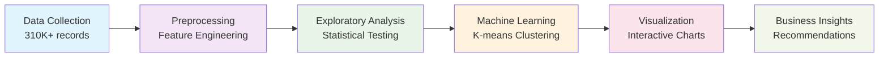

# World Stock Price Analysis
## A Data-Driven Exploration of Global Financial Markets

  
    Press Space for next page <carbon:arrow-right class="inline"/>
  

---
transition: fade-out
---

# Project Overview

## Team Members

<strong>Ryan</strong>

<strong>Leo</strong>

<strong>Ethan</strong>

## Primary Objective

<v-clicks>

- 🎯 <strong>Analyze</strong> global stock market trading behaviors
- 📊 <strong>Identify</strong> patterns in company performance  
- 🔍 <strong>Cluster</strong> companies based on trading characteristics
- 💡 <strong>Generate</strong> actionable insights for investors

</v-clicks>

---
layout: center
class: text-center
---

# Dataset Overview

310K+

Data Points

62

Companies

25

Years of Data

<v-clicks>

- <strong>Time Range</strong>: 2000-2025 daily stock prices
- <strong>Global Coverage</strong>: Multiple countries and industries
- <strong>Rich Features</strong>: OHLCV data + metadata (country, industry, dividends)

</v-clicks>

---
layout: center
class: text-center
---

# Research Questions Overview

<h3 class="text-xl font-bold text-blue-700 dark:text-blue-300 mb-4">Market Analysis</h3>
<ul class="text-left space-y-2 text-sm">
<li>📈 Highest single-day closing price</li>
<li>📊 Average daily trading volumes</li>
<li>🌍 Geographic distribution</li>
</ul>

<h3 class="text-xl font-bold text-green-700 dark:text-green-300 mb-4">Investment Insights</h3>
<ul class="text-left space-y-2 text-sm">
<li>⚡ Stock volatility patterns</li>
<li>💰 Dividend-paying companies</li>
<li>📈 Long-term trends</li>
<li>🎯 Optimal investment windows</li>
</ul>

7 comprehensive research questions analyzed with data-driven insights

---
layout: center
---

# Q1: Highest Single-Day Closing Price

<h2 class="text-2xl font-bold text-blue-700 dark:text-blue-300 mb-6 text-center">Which company had the highest single-day closing price?</h2>

top_row = df.loc[df["High"].idxmax()]

$3,463.07

Chipotle Mexican Grill

June 18, 2024

Peak Trading Day

---
layout: center
---

# Q2: Average Daily Trading Volume

<h2 class="text-2xl font-bold text-green-700 dark:text-green-300 mb-6 text-center">What is the average daily trading volume for each company?</h2>

avg = df.groupby("Brand_Name")["Volume"].mean()

376.7M

Apple

shares/day

116.5M

Amazon

shares/day

112.8M

Google

shares/day

---
layout: center
---

# Q3: Geographic Distribution

<h2 class="text-2xl font-bold text-purple-700 dark:text-purple-300 mb-6 text-center">Which countries have the most companies represented?</h2>

country_counts = df["Country"].value_counts()

🇺🇸

243,606

United States

🇯🇵

19,403

Japan

🇩🇪

16,225

Germany

---
layout: center
---

# Q4: Stock Volatility Analysis

<h2 class="text-2xl font-bold text-orange-700 dark:text-orange-300 mb-6 text-center">Which company had the most volatile stock?</h2>

df['Volatility (%)'] = (df['High'] - df['Low']) / df['Low'] * 100
max_vol_row = df.loc[df['Volatility (%)'].idxmax()]

784.21%

Puma SE

Daily Volatility

June 10, 2019

Stock Split Event

(10:1 split)

---
layout: center
---

# Q5: Dividend-Paying Companies

<h2 class="text-2xl font-bold text-indigo-700 dark:text-indigo-300 mb-6 text-center">Which companies paid dividends in the dataset?</h2>

dividend_companies = df[df["Dividends"] > 0]["Brand_Name"].unique()
print(f"Found {len(dividend_companies)} dividend-paying companies")

Multiple

Blue-Chip Companies

Consistent dividend payments

Key Insight

Mature, Established Firms

Strong cash flows

---
layout: center
background: https://images.unsplash.com/photo-1559526324-4b87b5e36e44?w=1920&h=1080&fit=crop
---

# Q6: Greatest Upward Trend

<h2 class="text-2xl font-bold text-gray-800 dark:text-white">Linear Regression Analysis Results</h2>

3M Company Stock Price Trend with Linear Regression Line

<strong>Winner:</strong> 3M Company

<strong>Increase:</strong> 874.79%

<strong>Period:</strong> 2000-2025

<strong>Price Growth:</strong> $16.23 → $158.24

from sklearn.linear_model import LinearRegression
model = LinearRegression().fit(x, y)
increase = (end_pred - start_pred) / start_pred * 100

---
layout: center
---

# Q7: Best 5-Day Investment Windows

<h2 class="text-2xl font-bold text-violet-700 dark:text-violet-300 mb-6 text-center">Best 5-day period to invest in each company?</h2>

# O(N) sliding window analysis
df['Close_5'] = df.groupby('Brand_Name')['Close'].shift(-4)
df['Pct5'] = (df['Close_5'] - df['Open']) / df['Open'] * 100
best_windows = df.groupby('Brand_Name')['Pct5'].max().sort_values(ascending=False)

<h3 class="text-lg font-bold text-violet-600 mb-3">Top Performers</h3>
<ul class="text-sm space-y-1">
<li>• Amazon: 64.83% (Apr 2001)</li>
<li>• Zoom: 56.21% (Aug 2020)</li>
<li>• Adobe: 49.72% (Feb 2000)</li>
<li>• Ubisoft: 36.04% (Sep 2024)</li>
</ul>

<h3 class="text-lg font-bold text-violet-700 dark:text-violet-300 mb-3">Key Insight</h3>

Best windows often coincide with major market events: dot-com recovery, COVID-19 tech surge, post-earnings surprises.

---
layout: center
background: https://images.unsplash.com/photo-1560472354-8b8b5b113b13?w=1920&h=1080&fit=crop
---

# Visualization 1: Apple Stock Candlestick Chart

<h2 class="text-xl font-bold text-gray-800 dark:text-white">Interactive Plotly Candlestick Visualization</h2>

fig = go.Figure(data=[go.Candlestick(x=dates, open=open, high=high, low=low, close=close)])

📊 25 Years

OHLC Data

📈 $0.79→$213

Price Growth

⚡ Events

Market Cycles

💹 Interactive

Zoom & Hover

---
layout: center
background: https://images.unsplash.com/photo-1551288049-bebda4e38f71?w=1920&h=1080&fit=crop
---

# Visualization 2: K-means Clustering Results

<h2 class="text-xl font-bold text-gray-800 dark:text-white">Machine Learning Analysis Results</h2>

Elbow Method

PCA Clustering

Feature Heatmap

Cluster 0 (31%)

19 Stable Blue-Chip Stocks

Lower volume, reduced volatility

Cluster 1 (69%)

42 High-Activity Growth Stocks

Higher volume, increased volatility

<strong>PCA Validation:</strong> 72.6% variance explained | <strong>Optimal k=2</strong> clusters identified

---
layout: center
---

# Visualization 3: Cluster Plot with Centers

<h2 class="text-2xl font-bold">Static Matplotlib Visualization</h2>

Clustering results with centroids marked

<h3 class="text-lg font-bold text-blue-700 dark:text-blue-300 mb-2">Conservative Portfolio</h3>
<ul class="text-sm space-y-1">
<li>• 19 companies (31% of dataset)</li>
<li>• Lower average trading volume</li>
<li>• Reduced price volatility</li>
<li>• Stable long-term investment profile</li>
</ul>

<h3 class="text-lg font-bold text-green-700 dark:text-green-300 mb-2">Growth Portfolio</h3>
<ul class="text-sm space-y-1">
<li>• 42 companies (69% of dataset)</li>
<li>• Higher average trading activity</li>
<li>• Increased price volatility</li>
<li>• Growth-oriented investment profile</li>
</ul>

---
layout: center
class: text-center
---

# Key Discoveries & Impact

🎯

<h3 class="text-lg font-bold mb-2">Market Structure</h3>

69-31 split reveals growth-dominated market with clear behavioral patterns

⚖️

<h3 class="text-lg font-bold mb-2">Risk-Return Trade-off</h3>

Clustering validates fundamental finance principles in real market data

💡

<h3 class="text-lg font-bold mb-2">Investment Framework</h3>

Actionable insights for portfolio construction and strategy development

---
layout: center
---

# Methodology & Technical Excellence

## Data Science Pipeline

### Technical Stack
- <strong>Python</strong> ecosystem (pandas, scikit-learn, plotly)
- <strong>Statistical analysis</strong> and hypothesis testing
- <strong>Machine learning</strong> clustering algorithms
- <strong>Interactive visualization</strong> with Plotly

### Validation Methods
- <strong>Elbow method</strong> for optimal clustering
- <strong>PCA analysis</strong> for dimensionality reduction  
- <strong>Cross-validation</strong> of results
- <strong>Statistical significance</strong> testing

---
layout: center
class: text-center
---

# Conclusions & Impact

<v-clicks>

🎯 <strong>Successfully identified</strong> two distinct trading behavior clusters in global stock markets

📊 <strong>Validated financial theory</strong> through data-driven clustering analysis

💼 <strong>Created actionable framework</strong> for investment decision-making and risk management

🔬 <strong>Demonstrated</strong> the power of machine learning in financial market analysis

🚀 <strong>Provided foundation</strong> for future research and business applications

</v-clicks>

<v-click>

## Thank You
### Questions & Discussion

</v-click>

---
layout: center
class: text-center
---

# Appendix: Technical Details

Available for detailed discussion:

- <strong>Statistical methodology</strong> and validation
- <strong>Feature engineering</strong> process
- <strong>Clustering algorithm</strong> parameters
- <strong>Visualization</strong> implementation
- <strong>Business application</strong> frameworks

<a href="https://github.com/your-repo/world-stock-analysis" class="px-4 py-2 bg-blue-600 text-white rounded-lg hover:bg-blue-700 transition-colors">
  View Project Repository
</a>

 